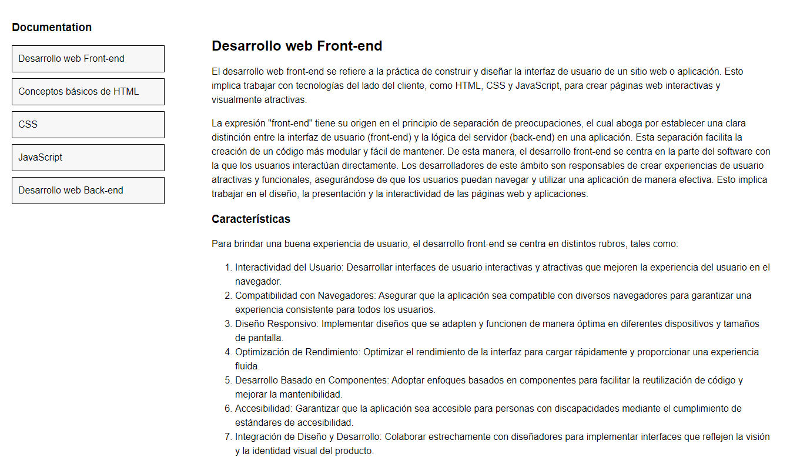

# FAQ

Homework for the Full Stack Web Development course from https://factoriaf5.org.
Practice HTML. 

## Preview:


## Install
```bash
git clone https://github.com/OlenaAndrushchenko/FAQ.git
```

## Stack
- HTML
- CSS